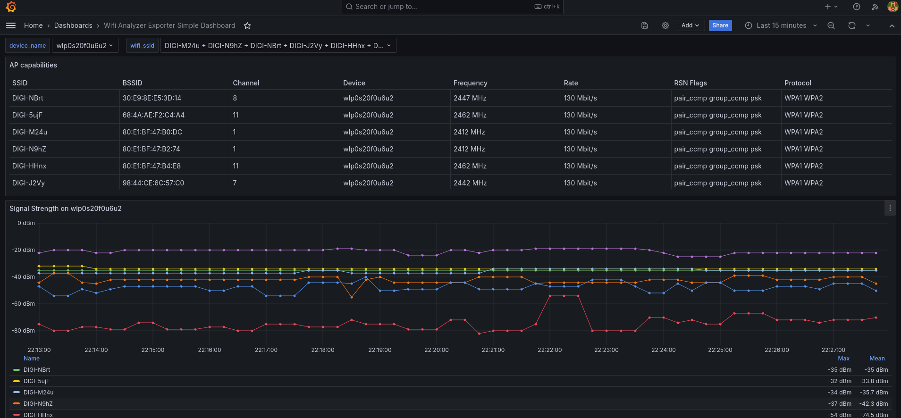

# Wifi Analyzer Exporter

This exporter gives you data about the detected newarby WiFi networks using Network Manager's CLI (`nmcli`).

Wifi Analyzer Exporter is very useful for:
 * finding the best location for an Access Point inside your office.
 * benchmarking your WiFi adapter.
 * and possibly others. 

The project name is directly inspired from the original [Wifi Analyzer mobile application](https://www.wifianalyzer.info/).

## Setup python virtual environment

```bash
python -m venv --prompt virtualenv .venv
source .venv/bin/activate
pip install -r requirements.txt
```


## Start application

```
python wifianalyzer_exporter.py
```

The following arguments can be passed to the exporter application:

 * `--listen-address`: Listen IP address, defaults to `0.0.0.0`.
 * `--port`: Listen port, defaults to `9106`.
 * `--interval`: Time interval between wifi scans, defaults to `30`.


## Grafana dashboard

A grafana dashboard sample can be found in [dashboard dir](./dashboard/wifianalyzer_exporter_dashboard_simple.json).


